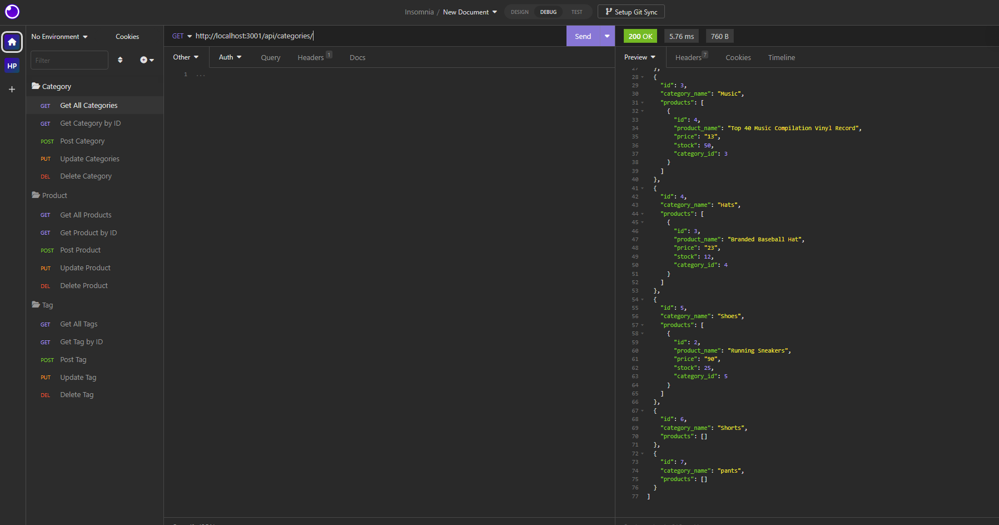
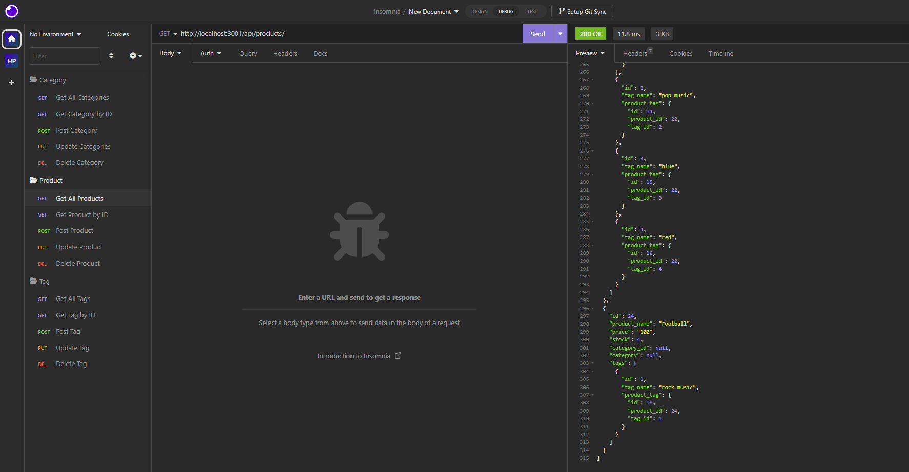
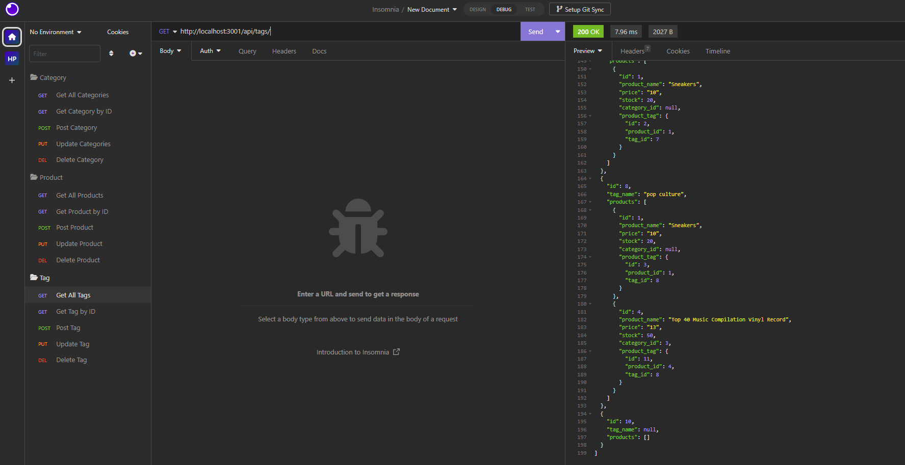

# E-commerce-Back-End

## Description

This application consists of building the back end for an e-commerce website.

## Walkthrough

https://drive.google.com/file/d/13e9PxudRNwOWapecnioxitrNACSq_MjY/view?usp=sharing

## Table of Contents

- [Project Description](#description)
- [Installation](#installation)
- [Contributing](#contributing)
- [Tests](#tests)
- [Mock-Up](#mock-up)
- [Technologies Used](#technologies-used)
- [License](#license)
- [Github](#github)
- [Questions](#questions)

## Installation

  - Clone the repo
  - run npm install
  - cd into db 
  - log into the mysql shell and run SOURCE schema.sql 
  - Exit
  - cd ..
  - npm run seed 
  - node server.js

## Contributing

Anyone can contribute to this project to make it better. Pull requestes are always welcome!

## Tests

npm install
Node server.js
Open browser and type http://localhost:3001/ to run this application

## Mock-Up

The following images show the web application's appearance and functionality:

## Technologies Used

- Node.js
- Javascript
- Express.js
- Sequelize
- MySQL2
- MySQL
- dotenv

## License

MIT

## Github

User: https://github.com/Hinalpatel8988
Github Repo: https://github.com/Hinalpatel8988/E-commerce-Back-End.git

## Questions

If you have any questions about repo, please open an issue.